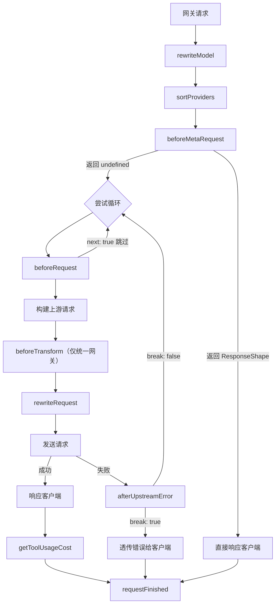

# PicoTera 脚本开发文档

PicoTera 支持用 JavaScript 脚本定制网关行为：在请求处理的各个阶段执行脚本逻辑，实现路由定制、请求改写、熔断重试、用量记账等。脚本由管理员在仪表盘「脚本」页面维护；本文档面向脚本作者，描述脚本可用的全部接口：十个 hook 的执行顺序与输入输出、全局上下文 `ctx` 的字段，以及 `picotera` 全局对象下的各个 API。

文中类型标注采用 TypeScript 风格（如 `Record<string, string>` 表示字符串键值对对象），仅用于说明，脚本本身是普通 JavaScript。

## 脚本如何运行

- **每个请求一个独立的 JS 环境**：网关完成认证后为该请求创建脚本环境，从 `rewriteModel` 前一直存在到请求结束。环境之间互不影响，但同一请求内所有 hook、所有脚本共享同一个全局 `ctx`。
- **脚本加载**：所有启用的脚本按固定顺序在全局作用域各执行一次。脚本不导出任何东西，而是在顶层调用 `picotera.hooks.<name>.tap(...)` 注册回调。
- **waterfall（瀑布链）语义**：每个 hook 是一组按优先级排序的回调链。`tap(name, fn, priority?)` 中 `name` 用于标识该回调；`priority` 默认为 `0`，数值大的先执行，相同优先级先注册的先执行。回调签名为 `fn(ctx, value)`：
  - 返回 `undefined`（或不返回）：当前值原样传给下一个回调；
  - 返回其他任何值：替换当前值，后续回调收到新值；
  - 最后一个回调的返回值就是整个 hook 的结果。

  因此一个脚本通常只消费关心的字段，然后 `return input`（或直接不返回）把控制权交给后面的回调。

- **同步执行**：hook 回调和 `picotera.*` 下的所有调用都是同步的，没有 `async`/`await`。

## Hook 一览与执行顺序

十个 hook：

| Hook | 概要 |
| --- | --- |
| `rewriteModel` | 改写客户端请求的模型名（每请求一次） |
| `sortProviders` | 对候选渠道排序/过滤（每请求一次） |
| `beforeMetaRequest` | 首次上游尝试前：可直接返回响应短路整个请求（每请求一次） |
| `beforeRequest` | 每次上游尝试前：决定发起/跳过/延迟/覆盖上游模型 |
| `beforeTransform` | 统一网关的跨格式转换前：定制出站转换配置 |
| `rewriteRequest` | 改写即将发出的上游请求（URL、请求头、请求体）；「获取模型列表」拉取前也会执行一次 |
| `afterUpstreamError` | 上游尝试失败后：决定中断透传还是继续 |
| `getToolUsageCost` | 请求成功后：改写工具用量并给出工具费用（每次成功请求一次） |
| `rewriteProviderModels` | 「获取模型列表」时改写渠道的模型配置 |
| `requestFinished` | 请求结束后观察结果（只读记账，每请求一次） |

### 单次请求中的执行顺序



1. **`rewriteModel`**：改写模型名。返回不同值后，请求体中的模型字段、`ctx.request.model`、`ctx.routedModel`、`ctx.annotations` 都会随之更新。
2. **`sortProviders`**：拿到全部候选渠道，返回数组即为后续尝试顺序。
3. **`beforeMetaRequest`**：尝试循环开始前执行一次。返回 `undefined` 照常继续；返回 `ResponseShape` 则该响应直接写给客户端，完全不发起上游请求。
4. **尝试循环**：按排序结果逐候选尝试。每次尝试执行 `beforeRequest` → 构建上游请求（统一网关外加 `beforeTransform` 与格式转换）→ `rewriteRequest` → 发送。
   - **重试**：一次失败且未中断时，循环回到同一候选，此时 `beforeRequest` 输入的 `next` 默认为 `true`（前进到下一候选）；返回 `next: false` 即原地重试。`ctx.attempt.currentRetryCount` / `totalAttemptCount` 供决策。
   - 尝试总次数有上限（默认 50 次）。
5. **`getToolUsageCost`**：某次尝试成功、上游响应读取完毕后执行一次，把工具用量与工具费用写进请求记录。
6. **`requestFinished`**：请求进入终态后执行一次，返回值被忽略，用于记账、打注解等观察性用途。

「获取模型列表」（在渠道表单中向上游拉取模型名）是一条独立管理链路，与上述流程无关：拉取前执行一次 `rewriteRequest`，拉取后执行一次 `rewriteProviderModels`，两者共用同一个会话的 `ctx`（脚本挂在 `ctx` 上的自定义字段可以跨这两个 hook 传递）。

## 各 Hook 详解

### rewriteModel

**时机**：每次请求一次，在候选渠道解析之前。返回的模型名决定路由到哪些渠道。

**输入 / 返回**：`string` → `string`。返回原值（或不返回）表示不改写。

```js
picotera.hooks.rewriteModel.tap('alias', function (ctx, model) {
  if (model === 'gpt4') return 'gpt-4o'
  return model
})
```

**注意**：

- 在无模型端点（如模型列表接口）上返回非空字符串会导致请求失败——不要为无模型请求凭空造模型名。
- 此时 `ctx.provider`、`ctx.providerModel`、`ctx.attempt`、`ctx.upstreamRequest` 尚为 `null`。
- 改写会同步更新请求体中的模型字段；之前拿到的 `ctx.request.body` Proxy 会作废，应在使用前重新访问。

### sortProviders

**时机**：每次请求一次，候选渠道确定后、尝试开始前。

**输入**：`Candidate[]`

```ts
interface Candidate {
  provider: ProviderSummary             // 见 ctx 字段定义
  providerModel: ProviderModel          // 见 ctx 字段定义
  annotations: Record<string, string>   // 该候选的完整合并注解
}
```

**返回**：`Candidate[]`。可排序、过滤、修改元素内容。每个元素必须能对应回原候选——按 `provider.id` 对应（统一网关还需 `providerModel.endpoint` 一致），对不上的元素会被跳过。

**注意**：输入数组的顺序没有保证，需要按 `priority` 等排序时在此实现。

```js
picotera.hooks.sortProviders.tap('by-priority', function (ctx, candidates) {
  return candidates
    .filter(c => c.annotations['team'] === 'core')
    .sort((a, b) => b.provider.priority - a.provider.priority)
})
```

### beforeMetaRequest

**时机**：每次请求一次，在 `sortProviders` 之后、第一次上游尝试之前。`sortProviders` 返回空数组（无可用渠道）时同样执行。「获取模型列表」链路不执行。

执行时 `ctx.provider`、`ctx.providerModel`、`ctx.attempt`、`ctx.upstreamRequest` 均为 `null`（尚未进入尝试循环），其余字段（`endpoint`、`request`、`apiKey`、`user`、`routedModel`、`annotations`、`metaRequest`、`stream`、`sourceFormat`、`format`）已就绪。

**输入 / 返回**：waterfall 初值为 `undefined`。

```ts
type BeforeMetaRequestResult = undefined | ResponseShape

interface ResponseShape {
  statusCode: number                              // 整数，100–599
  headers?: Record<string, string | string[]>     // 可选
  body?: string | object | Array<unknown> | null  // 可选
  tokens?: ResponseTokens                         // 可选，用量记账
}

interface ResponseTokens {
  inputTokens?: number
  outputTokens?: number
  cacheReadTokens?: number
  cacheWriteTokens?: number
  cacheWrite1hTokens?: number
}
```

- 返回 `undefined` / `null`：不干预，正常继续后续流程。
- 返回 `ResponseShape`：网关直接把它写给客户端，**不发起任何上游请求**。
  - `body` 为字符串：原样写出（流式场景可自行返回 `text/event-stream` 加手工拼接的 SSE 文本）。
  - `body` 为对象/数组（包含 `ctx.request.body` 这类 Proxy）：`JSON.stringify` 后写出。
  - `body` 缺省 / `null`：空响应体。
  - **Content-Type**：响应体非空且 `headers` 未指定时默认 `application/json`；指定了则以脚本为准。
  - `tokens`：填哪个记哪个，未填的列保持空；填了 `tokens` 时按当前模型的 pricing 自动计算并记录费用。

**校验规则（严格，违反即请求失败）**：

- 返回值必须是 `undefined`、`null` 或普通对象；数组、字符串、数字均报错。
- `statusCode` 必须是 `[100, 599]` 内的整数。
- `headers` 若存在必须是普通对象，值必须是 `string` 或 `string[]`。
- 不允许设置 `Content-Length` / `Transfer-Encoding`（大小写不敏感），由服务端计算。
- `body` 只接受 `string` / 对象 / 数组 / `null` / `undefined`；number、boolean、function 报错。
- `tokens` 若存在必须是普通对象，键只能是上述五个之一（拼错即报错），值必须是 `[0, 2147483647]` 内的整数。

校验失败与 hook 抛错同等对待：请求立即失败（502；hook 超时 503），不再尝试任何渠道。

**记录语义**：

- 不产生上游请求记录；`provider_id`、`upstream_model`、ttft 均为空，请求列表中这类请求的特征是只有主记录、没有上游子记录。
- 非 2xx 时错误信息记为响应体文本；2xx 时不记。
- `requestFinished` 照常触发，其输入中未发生的字段为 0（填了 `tokens` 则能读到）。
- 成功率统计要求 `finishReason = 3` 且 `outputTokens` 非零，因此 2xx 快速响应只有填了非零 `outputTokens` 才计为成功，否则计入「空回复」。

```js
// 命中缓存直接返回（Anthropic Messages 格式）
picotera.hooks.beforeMetaRequest.tap('cache', function (ctx) {
  if (ctx.stream) return
  const hit = picotera.kv.get('resp:' + ctx.routedModel.name + ':' + ctx.request.body.messages.at(-1).content)
  if (!hit) return
  return {
    statusCode: 200,
    headers: { 'X-PicoTera-Cache': 'hit' },
    body: hit,
    tokens: {
      inputTokens: hit.usage.input_tokens,
      outputTokens: hit.usage.output_tokens,
    },
  }
})
```

### beforeRequest

**时机**：每次上游尝试（含重试）开始时。执行前 `ctx.provider`、`ctx.providerModel`、`ctx.annotations`、`ctx.attempt` 已更新为当前候选；`ctx.upstreamRequest` 此时为 `null`。

**输入 / 返回**：

```ts
interface BeforeRequestDecision {
  next: boolean        // true：跳过当前候选，进入下一候选
  delay: number        // 发起请求前等待的毫秒数
  upstreamModel: string // 非空：覆盖本次尝试发往上游的模型名
}
```

waterfall 初值为 `{ next: 是否重试状态, delay: 0, upstreamModel: "" }`：首次尝试某候选时 `next` 为 `false`（正常发起）；该候选失败过则默认为 `true`（不再原地重试，直接前进到下一候选）。脚本返回 `next: false` 才会重试同一候选。

- `delay` 有上限（默认 60 秒）。
- `upstreamModel` 只影响本次尝试，不修改任何 `ctx` 字段。

```js
// 同一渠道最多重试 2 次，间隔递增
picotera.hooks.beforeRequest.tap('retry', function (ctx, input) {
  return {
    next: !(ctx.attempt.currentRetryCount < 2 && ctx.attempt.totalAttemptCount < 5),
    delay: ctx.attempt.currentRetryCount * 500,
  }
})
```

### beforeTransform

**时机**：仅 `/api/unified` 统一网关，每次尝试在跨格式转换前执行一次（即使本次源格式与上游格式相同、不发生实际转换）。路径网关不执行；Codex 透传路由（`/api/unified/codex/responses/compact`、`/api/unified/v1/alpha/search`）没有跨格式转换，也不执行。

**输入 / 返回**：

```ts
interface OutboundProfile {
  type: string                 // 出站转换器类型
  config: Record<string, any>  // 转换器配置，空视为 {}
}
```

输入的 `type` 是按上游格式推导的默认值：`anthropic`、`openai`、`openaiResponses`、`gemini`。返回可替换该选择或附加配置，常结合 `ctx.providerModel.upstreamFormat`、`ctx.sourceFormat`、`ctx.stream` 判断。

### rewriteRequest

**时机**：每次尝试中、发送前最后一刻。此时能看到的已是**上游格式**的请求（含格式转换的结果）。

**输入 / 返回**：

```ts
interface PendingRequest {
  url: string                       // 完整 URL（含查询串）
  method: string
  headers: Record<string, string[]> // 键为小写；上游凭证已注入
  body: any                         // 请求体 Proxy，见「请求体 Proxy」
}
```

直接就地修改 `pending` 即生效：改 `url`/`method`/`headers` 会用于重建请求；`body` 是 Proxy，对其字段的读写直接作用于服务端请求体。不修改 body（含直接透传返回）时按原字节发送，无额外开销。

```js
picotera.hooks.rewriteRequest.tap('add-effort', function (ctx, pending) {
  if (ctx.format === 'openaiChatCompletions') {
    pending.body.reasoning_effort = 'high'
  }
})
```

**注意**：非 JSON 请求没有 `pending.body`（为 `undefined`）。

**获取模型列表**：`rewriteRequest` 也会在「获取模型列表」拉取前执行一次（`ctx.endpointType === 'fetchModels'` 判别）。这条链路上可见的 ctx 字段只有 `ctx.provider` 与 `ctx.annotations`（见 `rewriteProviderModels` 一节）；`pending` 是发往 `provider.modelsEndpointUrl` 的 GET 请求，凭证已注入 `pending.headers`。这次请求没有 body，`pending.body` 为 `undefined`；就地给 `pending.body` 赋值不生效，脚本要携带请求体必须返回一个新对象，例如把拉取改成 POST：

```js
picotera.hooks.rewriteRequest.tap('models-post', function (ctx, pending) {
  if (ctx.endpointType !== 'fetchModels') return
  return { ...pending, method: 'POST', headers: { ...pending.headers, 'content-type': ['application/json'] }, body: { scope: 'all' } }
})
```

### afterUpstreamError

**时机**：每次失败的尝试之后。覆盖：HTTP 非 200、连接/网络失败、流式响应中的 SSE 错误事件（`streamed: true`）等。脚本自身抛错/超时不触发。

**输入**：

```ts
interface UpstreamError {
  break: boolean     // 是否中断：不再尝试其它渠道，直接把错误响应写给客户端
  statusCode: number // 上游原始状态码；连接失败等为 0
  message: string    // 错误信息（非 200 时为上游响应体文本）
  streamed: boolean  // 客户端响应是否已开始流式输出
}
```

waterfall 初值：状态码恰为 400 且未流式时 `break` 默认为 `true`（上游 400 默认透传给客户端），其余默认 `false`。脚本可据此默认值决定是否覆盖。

**返回**：

```ts
interface AfterUpstreamErrorDecision {
  break: boolean
  statusCode: number // >0：覆盖写给客户端的状态码；<=0：跟随上游
  message: string    // 非空：作为响应体（application/json）；空：透传上游原始响应体
}
```

**注意**：

- `streamed: true` 时客户端已收到部分响应，`break` 无效，hook 仅可用于观察（日志、计数等）。
- hook 自身出错视为 `break: false`（继续尝试下一候选）。
- 执行前 `ctx.attempt.lastError` 已更新为本次失败信息，并保留到下一次尝试的 `beforeRequest`。

```js
// 熔断计数（配合 beforeRequest 使用）
picotera.hooks.afterUpstreamError.tap('circuit-breaking', function (ctx, input) {
  const key = `fail:${ctx.provider.id}:${ctx.routedModel.name}`
  picotera.kv.setex(key, 60, (picotera.kv.get(key) ?? 0) + 1)
  return input
})
```

### getToolUsageCost

**时机**：每次**成功**的请求一次——上游响应读取完毕、请求记录写库之前。失败的请求、以及被 `beforeMetaRequest` 短路的请求不执行（没有上游响应，也就没有工具用量）。

PicoTera 会从上游响应里抽取工具用量（web 搜索次数、图片生成张数等）写入 `toolUsage`，但**不计算工具费用**——各家上游的工具计价规则差异太大。本 hook 就是补上这块：拿到抽取结果，返回修正后的用量和你自己算出来的费用。

**输入 / 返回**：

```ts
interface ToolUsageCost {
  toolUsage: ToolUsageEntry[]     // 抽取到的用量；上游没报告时为 []
  usageRaw: object | null         // 【只读】上游原始 usage 对象；未报告时为 null
  toolUsageRaw: object | null     // 【只读】上游原始 tool_usage 对象；未报告时为 null
  toolCost: number | null         // 工具费用；初值恒为 null
  toolCostCurrency: string        // 费用币种；初值恒为 ''
}

interface ToolUsageEntry {
  name: string            // 工具名，如 web_search、image_gen
  model?: string          // 上游为该工具声明的模型（通常只有图片生成有）
  numRequests?: number    // 调用次数
  inputTokens?: number
  outputTokens?: number
  numImages?: number      // 生成图片张数
}
```

`toolUsage` 恒为数组，可以直接遍历不用判空。返回 `undefined` / `null` / `ctx` / 原样的 `input` 对象表示不干预，保持初值。

`usageRaw` / `toolUsageRaw` 是上游报的原始对象，形状随上游而定，用来按上游真实计价规则算钱。`usageRaw` 采用整对象末次覆盖：Anthropic 流式最终留下的是 `message_delta` 的 `usage`，其中没有 `message_start` 的输入与缓存明细。

**写入语义**：脚本返回什么就记什么。

- 返回 `toolUsage: []` 会把抽取到的用量清空。
- 值为 `0` 的计数器不会写入；四个计数器全为 0 的条目被整条丢弃，声明了 `model` 也一样（上游枚举的是它**支持**的工具，而不是实际调用过的，例如 Codex 每次响应都带一个全零的 `image_gen`）。
- `toolCost` 为空时费用与币种都不记录。币种不校验，也不查汇率表。
- 主请求记录与本次成功的上游请求记录写入同一份结果。
- 两个 raw 字段只读：返回值只取 `toolUsage` / `toolCost` / `toolCostCurrency` 三项重建，带上它们既不报错也不生效，落库始终是抽取到的原值。

**校验规则（严格，违反即视为 hook 出错）**：

- 返回值必须是普通对象；数组、字符串、数字均报错。
- `toolUsage` 必须存在且是数组，元素必须是普通对象。
- 条目的键只能是上表列出的六个（拼错即报错——否则计费字段会被静默丢弃）。
- `name` 必填，非空字符串；`model` 出现时必须是字符串；四个计数器出现时必须是 `>= 0` 的安全整数。
- `toolCost` 为 `null` / 缺省表示不计费；否则必须是 `[0, 1e14)` 内的有限数字。
- `toolCostCurrency`：`toolCost` 是数字时必须是非空字符串；`toolCost` 为空时必须缺省或空串。

**出错行为**：本 hook 是观察性的——响应此时已经发给客户端了。抛错、校验失败或超时只记一条 warn 日志，`toolUsage` 回退为抽取到的原值、费用两列留空，请求本身和成功率统计都不受影响。

```js
// 按 web 搜索次数计费
picotera.hooks.getToolUsageCost.tap('price-search', function (ctx, input) {
  const searches = input.toolUsage.find(t => t.name === 'web_search')?.numRequests ?? 0
  if (!searches) return
  return { toolUsage: input.toolUsage, toolCost: searches * 0.01, toolCostCurrency: 'USD' }
})
```

### requestFinished

**时机**：每次请求结束后执行一次（无论成功失败），返回值被忽略。典型用途：用量记账、按结果给请求打注解。

**输入**：

```ts
interface RequestFinishedView {
  requestId: string         // 主请求记录 ID
  statusCode: number
  finishReason: number      // 见下方枚举
  errorMessage: string
  timeSpentMs: number       // 总耗时（毫秒）
  ttftMs: number            // 首 token 耗时（毫秒）
  inputTokens: number
  outputTokens: number
  cacheReadTokens: number
  cacheWriteTokens: number
  cacheWrite1hTokens: number
  modelCost: number         // 本次请求费用
  modelCostCurrency: string // 费用币种
  toolCost: number          // 工具费用，见 getToolUsageCost
  toolCostCurrency: string  // 工具费用币种
  providerId: number        // 实际成功的渠道
  model: string
  upstreamModel: string
  toolUsage: ToolUsageEntry[] // 工具用量，见 getToolUsageCost；恒为数组
  usageRaw: object | null     // 上游原始 usage 对象；未报告时为 null
  toolUsageRaw: object | null // 上游原始 tool_usage 对象；未报告时为 null
}
```

未发生的事件对应零值（例如全程失败的请求没有 token、费用与 providerId）；`toolUsage` 例外，恒为数组，可直接遍历。三个工具字段读到的是 `getToolUsageCost` 提交的最终结果。`finishReason` 枚举：`1` 内部错误、`2` 客户端取消、`3` 正常结束、`4` 上游响应头超时、`5` 流式读取超时、`6` 流中错误、`7` 手动中断。

两个 raw 字段与 `getToolUsageCost` 读到的是同一份原始对象，`usageRaw` 同样是整对象末次覆盖（Anthropic 流式留下 `message_delta` 的 `usage`）。它们只在成功路径写入，所以失败的请求恒为 `null`；未报告时也是 `null`，而不是 `toolUsage` 那样的空数组。

**注意**：认证失败等在脚本环境创建前就被拒绝的请求不会触发此 hook。

### rewriteProviderModels

**时机**：在渠道表单里执行「获取模型列表」时一次。PicoTera 向上游拉取模型名并与现有配置聚合，交给本 hook；返回值（丢弃 `model` 为空的条目并去重后）作为结果。

**输入 / 返回**：`ProviderModelEntry[]`

```ts
interface ProviderModelEntry {
  model: string
  upstreamModelName?: string
  endpoints?: string[]     // 允许访问该模型的端点路径
  priority?: number
  annotations?: Record<string, string>
  disabled?: boolean
}
```

**可用的 ctx 字段**：该流程没有客户端请求上下文，只有以下字段有意义：

- `ctx.endpointType`：恒为 `"fetchModels"`，与 `rewriteRequest` 共用同一会话；
- `ctx.provider`：当前渠道（`ProviderSummary`）；
- `ctx.annotations`：渠道层注解；
- `ctx.upstreamResponse`：上游 `/models` 响应解析后的原始 JSON（解析失败为 `null`），可从中自行提取模型名处理非标准响应。

```js
picotera.hooks.rewriteProviderModels.tap('only-free', function (ctx, entries) {
  return entries.filter(e => e.model.startsWith('free/'))
})
```

## 全局上下文 ctx

`ctx` 是贯穿整个请求的共享对象，随流程推进逐步填充；表中为各字段的最终形态，在未到达对应阶段时为 `null`（`stream` 初始 `false`，格式字段初始 `""`）。脚本可以向 `ctx` 挂载自定义字段（如 `ctx.myFlag = 1`），同一请求内跨 hook 共享、不会被覆盖。

| 字段 | 类型 | 说明 |
| --- | --- | --- |
| `endpointType` | `"gateway" \| "unified" \| "fetchModels"` | 路由形态：路径网关、`/api/unified` 统一网关，或「获取模型列表」链路 |
| `endpoint` | `EndpointSummary \| null` | 当前端点信息 |
| `requestModel` | `string \| null` | 客户端原始请求的模型名（改写前） |
| `routedModel` | `ModelSummary \| null` | 最终路由模型：`{ name: string, annotations: Record<string, string> }`，注解为模型层 |
| `request` | `RequestShape \| null` | 客户端入站请求 |
| `apiKey` | `ApiKeySummary \| null` | 本次请求使用的 API key |
| `user` | `UserSummary \| null` | API key 的属主用户 |
| `provider` | `ProviderSummary \| null` | 当前候选渠道（每次尝试前更新） |
| `providerModel` | `ProviderModel \| null` | 当前候选的模型配置（每次尝试前更新） |
| `attempt` | `AttemptState \| null` | 当前尝试的状态（每次尝试前更新） |
| `metaRequest` | `RequestRef \| null` | 主请求记录标识，配合 `picotera.request.setAnnotation` 使用 |
| `upstreamRequest` | `RequestRef \| null` | 当前尝试的上游请求记录标识；`beforeRequest` 时恒为 `null`，记录创建后填充 |
| `annotations` | `Record<string, string>` | 当前阶段的合并注解，见「注解合并规则」 |
| `stream` | `boolean` | 客户端是否期待流式响应 |
| `sourceFormat` | `string` | 客户端入站格式，见「格式枚举」 |
| `format` | `string` | 即将发往上游的请求格式；`rewriteRequest` 前更新为上游格式（路径网关通常与 `sourceFormat` 相同） |
| `upstreamResponse` | `any` | 仅 `rewriteProviderModels` 中存在，见该 hook |

### ctx.endpoint（EndpointSummary）

| 字段 | 类型 | 说明 |
| --- | --- | --- |
| `name` | `string` | 端点名称 |
| `path` | `string` | 端点路径模板（可含 `{name}` 占位符） |
| `modelPath` | `string` | 模型名的提取配置；空串表示无模型端点 |
| `credentialsResolver` | `number` | 凭证注入方式：`0` unknown、`1` followRequest、`2` bearerToken、`3` xApiKey、`4` searchKey、`5` googApiKey |
| `endpointType` | `number` | 端点类型（格式），见下表；注意与外层 `ctx.endpointType`（路由形态）区分 |

`endpoint.endpointType` 枚举：`0` unknown、`1` general、`2` openaiChatCompletions、`3` openaiResponses、`4` anthropicMessages、`5` anthropicCountTokens、`7` geminiGenerateContent、`8` geminiStreamGenerateContent、`9` exaSearch、`10` modelList。

### ctx.request（RequestShape）

| 字段 | 类型 | 说明 |
| --- | --- | --- |
| `path` | `string` | 客户端请求路径 |
| `method` | `string` | HTTP 方法 |
| `headers` | `Record<string, string[]>` | 请求头，键为小写 |
| `model` | `string` | 当前路由模型名（`rewriteModel` 后会更新） |
| `pathVars` | `Record<string, string> \| undefined` | 路径占位符的取值（如 `{model}`）；无占位符时不存在 |
| `body` | `any \| undefined` | 请求体 Proxy（JSON 请求才有），见「请求体 Proxy」 |

### ctx.apiKey / ctx.user

```ts
interface ApiKeySummary {
  id: number
  name: string
  annotations: Record<string, string>
  disabled: boolean
}

interface UserSummary {
  id: number
  name: string
  annotations: Record<string, string>
  isAdmin: boolean
}
```

均不含密钥等敏感字段。

### ctx.provider / ctx.providerModel

```ts
interface ProviderSummary {
  id: number
  name: string
  priority: number
  annotations: Record<string, string>  // 仅渠道层注解
  disabled: boolean
}

interface ProviderModel {
  name: string                         // 配置的模型名
  upstreamModelName: string            // 配置的上游模型名（可为空）
  endpoint: string                     // 该条目的端点路径
  priority: number                     // 条目优先级
  annotations: Record<string, string>  // 仅模型条目层注解
  upstreamFormat: string               // 该条目上游端点类型的字符串,取值见下方端点类型枚举
}
```

渠道凭证不会进入脚本环境。

### ctx.attempt（AttemptState）

| 字段 | 类型 | 说明 |
| --- | --- | --- |
| `currentRetryCount` | `number` | 当前候选已连续尝试（含重试）的次数 |
| `totalAttemptCount` | `number` | 本请求累计尝试次数 |
| `lastError` | `{ providerId: number, statusCode: number, message: string } \| null` | 上一次尝试的失败信息；首次尝试为 `null` |

### ctx.metaRequest / ctx.upstreamRequest（RequestRef）

| 字段 | 类型 | 说明 |
| --- | --- | --- |
| `id` | `string` | 请求记录 ID（`picotera.request.setAnnotation` 的第一个参数） |
| `spanId` | `string` | span ID，主请求与其全部上游尝试共享 |
| `parentSpanId` | `string \| null` | 父 span ID（客户端会话标识） |
| `traceId` | `string \| null` | 关联 trace ID；无父 span 时为 `null` |

### 格式枚举（sourceFormat / format）

| 取值 | 含义 |
| --- | --- |
| `anthropicMessages` | Anthropic Messages |
| `openaiChatCompletions` | OpenAI Chat Completions |
| `openaiResponses` | OpenAI Responses |
| `geminiGenerateContent` | Gemini GenerateContent（非流式） |
| `geminiStreamGenerateContent` | Gemini GenerateContent（流式） |
| `unknown` | 其他端点类型（general、countTokens、modelList、Codex 透传路由等） |

### 端点类型枚举（upstreamFormat）

`providerModel.upstreamFormat` 给出的是该条目上游**端点类型**的字符串。上面五种生成格式的取值与格式枚举完全一致，此外还可能是 `general`、`anthropicCountTokens`、`exaSearch`、`modelList`、`codexCompact`、`codexSearchV1Alpha`、`unknown`。

### 注解合并规则

注解有五个来源层次，优先级从低到高：**模型（model）< 渠道（provider）< 渠道模型条目 < 用户（user）< API key**，同名字段高优先级覆盖低优先级。`ctx.annotations` 的范围随阶段变化：

- `rewriteModel`、`sortProviders`、`beforeMetaRequest` 阶段：只合并了「模型 < 用户 < API key」三层；
- `beforeRequest` 起（切换到具体候选后）：完整五层合并。

`Candidate.annotations` 始终是完整五层合并结果。

## picotera 全局 API

### 类型校验总则

注解相关 API 做严格类型校验，违规直接抛 `TypeError`，不做隐式转换：

- `requestId`：非空字符串；`providerId` / `apiKeyId`：整数；
- `key`：非空字符串；
- `value`：字符串（允许空串）、`null` 或 `undefined`——后两者表示**删除**该注解键。

这些调用都是同步的（一次一次生效，避免在循环中高频调用）。写入不存在的 ID 会抛错；`get` 查询不存在的 ID 返回 `null`。

### picotera.request.setAnnotation(requestId, key, value)

为指定请求记录写入/删除一条注解，通常配合 `ctx.metaRequest.id` / `ctx.upstreamRequest.id` 使用。写入后可在仪表盘的请求详情中查看、筛选。

```js
picotera.request.setAnnotation(ctx.metaRequest.id, 'billing.tier', 'pro')
picotera.request.setAnnotation(ctx.metaRequest.id, 'billing.tier', null) // 删除
```

### picotera.provider

```ts
picotera.provider.get(providerId: number): ProviderSummary | null
picotera.provider.setAnnotation(providerId: number, key: string, value: string | null | undefined): void
```

读取任意渠道信息（形状与 `ctx.provider` 相同，不含凭证），或写入渠道级注解。渠道注解对**之后**的请求生效，当前请求已合并的 `ctx.annotations` 不刷新。

### picotera.apiKey

```ts
picotera.apiKey.get(apiKeyId: number): ApiKeySummary | null
picotera.apiKey.setAnnotation(apiKeyId: number, key: string, value: string | null | undefined): void
```

同 `picotera.provider`，作用于 API key。

### picotera.kv

键值存储，用于熔断计数、限流等跨请求状态：

```ts
picotera.kv.get(key: string): any                                // 键不存在返回 null
picotera.kv.set(key: string, value: any): void                   // 永久保存
picotera.kv.setex(key: string, seconds: number, value: any): void // 带过期时间（秒）
picotera.kv.ttl(key: string): number  // 剩余秒数；-1 永不过期，-2 键不存在
picotera.kv.del(key: string): void
```

值以 JSON 序列化存储，`get` 返回反序列化后的对象。

### picotera.fetch(url, init?)

同步发起 HTTP 请求（整体超时 5 秒）：

```ts
picotera.fetch(url: string, init?: {
  method?: string                   // 默认 GET
  headers?: Record<string, string>
  body?: string
}): {
  status: number
  headers: Record<string, string[]>
  body: string                      // 响应体原文，未做 JSON 解析
}
```

### console

`console.log / info / warn / error / debug(...args)`：多参数拼接为一条消息，非字符串参数自动 `JSON.stringify`。输出会记录到服务端日志，并随请求存档可在请求详情中查看（有容量上限，超出截断）。`debug` 按 `info` 记录。

### 资源限制

单个 hook 的执行时间有超时限制（默认 5 秒），脚本环境的内存与日志量也有上限（默认分别为 64 MiB、1000 条），均由管理员配置。超时后错误会终止当前请求（见下节）。

## 请求体 Proxy（ctx.request.body 与 pending.body）

两个大型请求体（客户端请求体、待发送的上游请求体）以惰性 Proxy 暴露，而不是普通的 JS 对象：

- **惰性加载**：字段只有被实际读取时才进入 JS；从不访问 body 的脚本不付出解析开销。仅 JSON 请求存在，否则为 `undefined`。
- **写直达**：赋值、删除直接修改服务端请求体；`rewriteRequest` 完成后以最终状态发送。
- **赋值即深拷贝**：向 Proxy 赋一个普通对象或另一个 Proxy 会做深拷贝，不产生引用别名。
- **数组方法**：`map`/`filter`/`slice`/`forEach`/展开运算等只读方法，以及 `splice`/`push`/`pop`/`shift`/`unshift`/`reverse`/`sort` 均可正常使用。
- **会抛错的操作**：写入 `undefined` 或函数、数组越界写入、删除非末尾的数组元素、增大数组 `length`，以及请求体被替换后继续使用旧的引用（例如 `rewriteModel` 改写模型后，之前保存的 body 引用即作废，应重新访问 `ctx.request.body`）。

## 错误与失败行为

- hook 回调抛错或超时：当前请求立即失败（返回 502；超时返回 503），不再尝试其他渠道，错误信息作为响应内容。
- 例外：`afterUpstreamError`、`getToolUsageCost`、`requestFinished` 出错只记日志、按未干预处理，不影响请求。
- 脚本加载本身出错：所有请求都会失败，请先在测试环境验证脚本语法。

## 示例

更多可直接使用的示例见 [`docs/example-scripts/`](./example-scripts/)：熔断、重试规则、模型名归一化、按注解过滤渠道、工具用量计费等。

```js
// 改写模型名 + 在请求时添加参数
picotera.hooks.rewriteModel.tap('alias', function (ctx, model) {
  if (model === 'smart') return 'claude-sonnet-4-6'
  return model
})

picotera.hooks.rewriteRequest.tap('tune', function (ctx, pending) {
  if (ctx.format === 'anthropicMessages') {
    pending.body.max_tokens = Math.max(pending.body.max_tokens ?? 0, 8192)
  }
})
```
